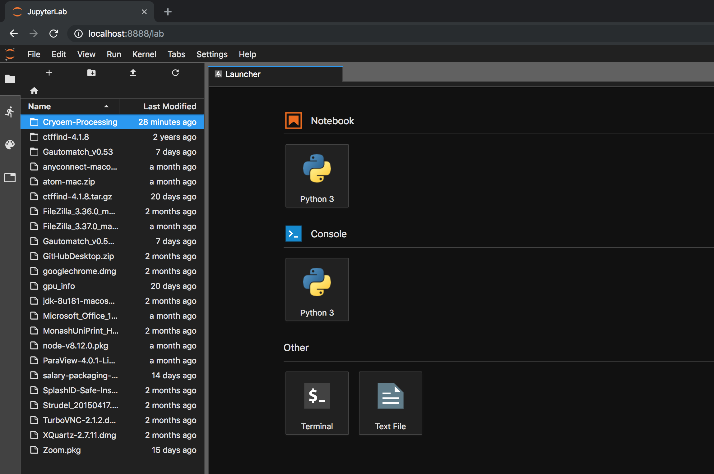
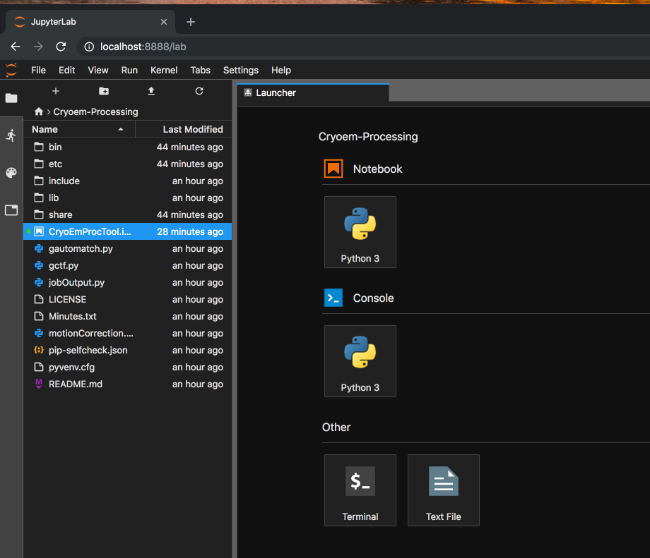

# Installation

This tool has been developed for deployment on Massive (https://massive.org.au) and runs as a Jupyter Lab.

Start your Desktop on Massive.
An 'Advanced' Desktop is recommended to gain suitable GPU performance.  
For help please refer to: https://docs.massive.org.au/M3/connecting/connecting-via-strudel.html

If you have previously installed, please see 'Running' below.

1. Clone the GitHub Repository

    ```
    git clone https://github.com/Characterisation-Virtual-Laboratory/Cryoem-Processing.git
    ```

2. Setup a python3 Virtual Environment.

   ```
   /usr/local/python/3.6.2-static/bin/python3 -m venv CryoEm-Processing
   ```

3. Activate the Virtual environment

  ```
  source CryoEm-Processing/bin/Activate
  ```

4. Install Jupyter, Jupyter Lab and Widgets.

  ```
  bash installNotebook.sh
  ```

5. Load the required HPC modules:

  ```
  module load motioncor2/2.1
  module load gctf/1.06_cuda8
  module load gautomatch/0.56
  ```

6. Start the Jupyter Lab.

  ```
  jupyter lab
  ```

7. Inside Jupyter Lab, open the CryoEm-Processing folder.

  

8. Double click on 'CryoEmProcTool.ipynb', you should now see the notebook.

  

9. Press Shift+Enter 3 times to execute the notebook.

  

10. The CryoEm Processing Tool is now ready.

  

# Running

Follow these instructions if you have previously installed.
Ensure your Massive Desktop is running.

1. Activate the Virtual environment

  ```
  source CryoEm-Processing/bin/Activate
  ```

2. Load the required HPC modules:

  ```
  module load motioncor2/2.1
  module load gctf/1.06_cuda8
  module load gautomatch/0.56
  ```

3. Start the Jupyter Notebook.

  ```
  jupyter lab
  ```
