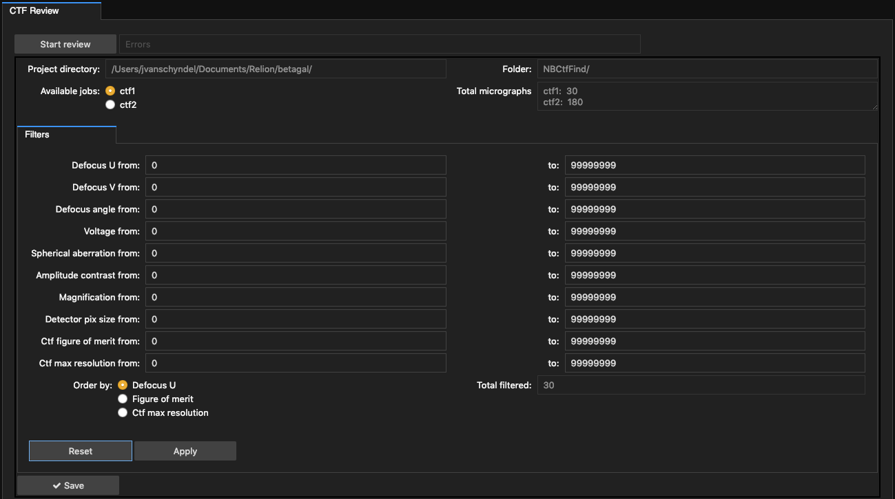

# User Guide

## Introduction

The Cryo Em Processing Tool was developed to expose all the options
available from MotionCor2 - Motion Correction (http://msg.ucsf.edu/em/software/motioncor2.html ),
Gctf (Contrast Transfer Function) and Gautomatch (Auto Particle Picking) (https://www.mrc-lmb.cam.ac.uk/kzhang/) through a user
friendly screen.

If you have not installed the tool, please refer to [Install.md](./Install.md)

### Processing Modes

The tool has been constructed to run MotionCor2, Gctf and Gautomatch as single independent programs or in a 'Workflow' mode to match the 'Relion 2' (https://www2.mrc-lmb.cam.ac.uk/relion/index.php?title=Main_Page) directory structure.

Please read the 'Single Process Mode' below but this tool has been defaulted to 'Workflow' mode.

#### Single Process Mode

To enable, click on the 'Single Process' button on the Workflow tab.


Single Process mode enables user input for the input/output fields to the three programs.

There are three main tabs, representing each program:

1. Motion Correction, based on MotionCor v2.1

  The tabs 'Basic' and 'Advanced' contain all the input fields.

  

2. Contrast Transfer, based on Gctf v1.06

  The tabs 'Normal', 'Phase Plate Options', 'Additional Options', 'Advanced Additional', 'Defocus Frame/Local', 'CTF Refinement' and 'CTF and IO' contain all the input fields.

  

3. Auto Particle Picking, based on gautomatch 0.56

  The tabs 'Basic', 'Additional', and 'I/O' contain all the input fields.

  

Each tab, works independently of the others. Jobs are created on each tab, only for that program.

__Running a Single Job__
  - clicking the 'Run' button will execute the program based on the input fields.

__Running Multiple Jobs__

  This process allow you to run the program against the same or different input files by altering parameters to obtain the best results for your data.

  1. Add Jobs:
      * Complete all fields as required. Ensure you complete the fields on all tabs. e.g. 'Basic' and 'Advanced' for Motion correction.
      * Click on 'Add' to create the job. A new row will appear in the 'Jobs' field.
      * Alter values as required and click 'Add' to add more jobs.
  2. Run Jobs:
      * Clicking on 'Run All' will execute all jobs created.
  3. Delete Jobs:
      * Using your mouse, select a job.
      * Click Delete.
  4. Update Job:
      * select the job and click 'Select'
      * alter values as required.
      * Click 'Update'.

**Note**: When running MotionCor2, Gctf or Gautomatch from any of these tabs, the programs behave as if they had been executed on the command line.

For a single program execution or job, all output, errors and Arguments are written to the fields, 'Standard output', 'Standard Error' and 'Arguments'.

The values from these fields are also written to files in the destination folder for your reference.  These files are appended for each program run.

_programName_-arguments.txt  
_programName_-error.txt  
_programName_-output.txt  

  


#### Workflow Mode

Workflow mode has been built to allow processing using all the options for MotionCor2, Gctf and Gautomatch while maintaining compatibility with the Relion 2 directory structure.

  

Ensure you have no 'Jobs' created in 'Single' mode as they will cause the 'Workflow' process to behave unexpectedly. e.g. file paths may be incorrect to maintain compatibility with the Relion workflow.

1. To enable 'Workflow' mode, click on 'Workflow'. This will protect and default values into certain fields for each of the three programs. e.g. all Output fields are pre populated and protected.

2. Add the full path of your Relion project to 'Project Directory'

  

3. Workflow mode, reads a Relion '.star' file as input. For the Motion Correction 'Input' field, enter the file path relative to the Relion project directory.

  

  **Note**: We are assuming you have used the Relion Import function to create the .star file.

4. Create jobs for Motion Correction, Contrast Transfer Function and Auto Particle Picking.

5. Click on 'Run all jobs'. This will execute all Motion Correction jobs. It will then run all Contrast Transfer Function jobs using the output from the Motion Correction jobs as input and lastly, Auto Particle picking will run all jobs using the output from the Motion Correction jobs as input.

6. All workflow jobs can be loaded and saved to disk by clicking on the 'Load Jobs' and 'Save Jobs' buttons. The file 'workflowJobs.data' will be created in the Project Directory. This feature allows you to develop a set of jobs, known to produce quality output to reuse on future datasets.

  

##### Workflow output

Below is a sample directory structure, relative to the Relion project directory, that is created when 2 jobs exist for each program.

```
  NBMotionCorr/mc1/Micrographs/
  NBMotionCorr/mc2/Micrographs/
  NBCtfFind/ctf1/Micrographs/
  NBCtfFind/ctf2/Micrographs/
  NBAutoPick/pick1/Micrographs/
  NBAutoPick/pick2/Micrographs/
```

The directory names NBMotionCorr, NBCtfFind, NBAutoPick have been chosen to make a distinction between this workflow and those folders created by Relion for the same processing.

The directories: mc1, mc2, ctf1, ctf2, pick1 and pick2 are the jobs created.


'NBMotionCorr/mc1/Micrographs/' and 'NBMotionCorr/mc2/Micrographs/' contain the output files from motioncor2.

```
MotionCor2 output files:
  Falcon_2012_06_12-14_33_35_0_DW.mrc
  Falcon_2012_06_12-14_33_35_0.mrc
```

'NBCtfFind/ctf1/Micrographs/' and 'NBCtfFind/ctf2/Micrographs/' contain symlinks to all output files from motioncor2 for jobs mc1 and mc2, plus the output from gctf for the jobs 'ctf1' and 'ctf2'. __Note: Only none dose weighted output files from motioncor2 are used as input to gctf.__

```
Gctf output files:
  mc1-Falcon_2012_06_12-14_33_35_0.ctf
  mc1-Falcon_2012_06_12-14_33_35_0_EPA.log
  mc1-Falcon_2012_06_12-14_33_35_0_gctf.log
  mc1-Falcon_2012_06_12-14_33_35_0.mrc
  mc2-Falcon_2012_06_12-14_33_35_0.ctf
  mc2-Falcon_2012_06_12-14_33_35_0_EPA.log
  mc2-Falcon_2012_06_12-14_33_35_0_gctf.log
  mc2-Falcon_2012_06_12-14_33_35_0.mrc
```

'NBAutoPick/pick1/Micrographs/' and 'NBAutoPick/pick2/Micrographs/' contain symlinks to all output files from motioncor2 for jobs mc1 and mc2, plus the output from gautomatch for the jobs 'pick1' and 'pick2'. __Note: Only none dose weighted output files from motioncor2 are used as input.__

```
Gautomatch output files:
  mc1-Falcon_2012_06_12-14_33_35_0_automatch.box
  mc1-Falcon_2012_06_12-14_33_35_0_automatch.star
  mc1-Falcon_2012_06_12-14_33_35_0.mrc
  mc1-Falcon_2012_06_12-14_33_35_0_nonunique.box
  mc1-Falcon_2012_06_12-14_33_35_0_rejected.box
  mc1-Falcon_2012_06_12-14_33_35_0_rejected.star
  mc2-Falcon_2012_06_12-14_33_35_0_automatch.box
  mc2-Falcon_2012_06_12-14_33_35_0_automatch.star
  mc2-Falcon_2012_06_12-14_33_35_0.mrc
  mc2-Falcon_2012_06_12-14_33_35_0_nonunique.box
  mc2-Falcon_2012_06_12-14_33_35_0_rejected.box
  mc2-Falcon_2012_06_12-14_33_35_0_rejected.star
```

__Important__ Note how the files for Contrast Transfer Function (ctf) and Auto Particle Picking (gautomatch) are prefixed with 'mc1' and 'mc2'. This represents the job output from Motion Correction. Each job for gctf and gautomatch is run against all job output from motion correction.

##### Customise

The directory names  (e.g. NBMotionCorr) and job prefixes (e.g. 'mc') can be customised by editing the appropriate python script.

workFlow.py contains the folder names. Just edit as shown here.

```
#Workflow processing for all programs and jobs.

class workFlow:
    #Settings:
    outputFilename = 'workflowJobs.data'
    motionCorrFolderName = 'NBMotionCorr/'
    gctfFolderName       = 'NBCtfFind/'
    gautomatchFolderName = 'NBAutoPick/'
```

motionCorrection.py, gctf-106.py and gautomatch.py each contain the job prefix. Just edit as shown here.

```
#Motion Correction input fields and functions to execute jobs

class motionCorrection:
    #Settings:
    program = 'motioncor2'
    jobPrefix = 'mc'
```

### CTF Review

CTF Review allows you to display, review, filter and save the filtered micrographs as a .star file ready for continued analysis inside Relion.


Click on 'Start Review'. This requires the 'Project Directory' to be completed in the 'Workflow' tab. The program then determines the existing CTF jobs.



A list of available jobs is displayed, the total number of micrographs for each job, fields for filtering results, ordering the results and the total number of filtered micrographs.

Alter the filter fields and order as required, click 'Apply'.
This will recalculate the total number of CTF micrographs to be displayed.
You may wish to complete this step where there are thousands of micrographs. Displaying all of them may require you to wait as they are all loaded, then displayed.


Click 'Review' to display the CTF micrographs.


For each CTF micrograph, the data can be viewed by clicking on the 'Data' button.


OR view the input to CTF by clicking on the 'Raw mrc' button.


#### Saving

To refilter, just alter the 'from' and 'to' values, click 'Apply', then 'Review'.

Repeat this step until the desired results are displayed.
When ready, clicking 'Save' will create a 'selected_micrographs_ctf.star' file inside the 'job' folder.

e.g. relionProjectDirectoryPath/NBCtfFind/ctf1/selected_micrographs_ctf.star
