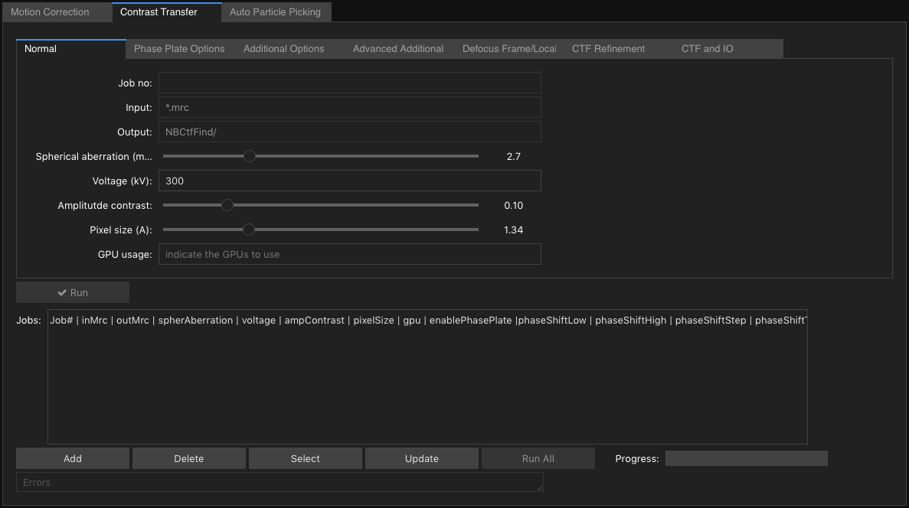

# User Guide

## Introduction

The Cryo Em Processing Tool was developed to expose all the options
available from MotionCor2 - Motion Correction (http://msg.ucsf.edu/em/software/motioncor2.html ),
Gctf (Contrast Transfer Function) and Gautomatch (Auto Particle Picking) (https://www.mrc-lmb.cam.ac.uk/kzhang/) through a user
friendly screen.

If you have not installed the tool, please refer to [Install.md](./Install.md)

### Processing Modes

The tool has been constructed to run MotionCor2, Gctf and Gautomatch as single independent programs or in a 'Workflow' mode to match the 'Relion 2' (https://www2.mrc-lmb.cam.ac.uk/relion/index.php?title=Main_Page) directory structure.

#### Single Process Mode

There are three main tabs, representing each program:

1. Motion Correction, based on MotionCor v2.1

  The tabs 'Basic' and 'Advanced' contain all the input fields.

  

2. Contrast Transfer, based on Gctf v1.18

  The tabs 'Normal', 'Phase Plate Options', 'Additional Options', 'Advanced Additional', and 'CTF and IO' contain all the input fields.

  

3. Auto Particle Picking, based on gautomatch 0.56

  The tabs 'Basic', 'Additional', and 'I/O' contain all the input fields.

  

Each tab, works independently of the others. Jobs are created on each tab, only for that program.

** Running a Single Job **
  - clicking the 'Run' button will execute the program based on the input fields.

** Running Multiple Jobs **

  This process allow you to run the program against the same or different input files by altering parameters to obtain the best results for your data.

  1. Add Jobs:
    - Complete all fields as required. Ensure you complete the fields on all tabs. e.g. 'Basic' and 'Advanced' for Motion correction.
    - Click on 'Add' to create the job. A new row will appear in the 'Jobs' field.
    - Alter values as required and click 'Add' to add more jobs.
  2. Run Jobs:
    - Clicking on 'Run All' will execute all jobs created.
  3. Delete Jobs:
    - Using your mouse, select a job.
    - Click Delete.
  4. Update Job:
     - select the job and click 'Select'
     - alter values as required.
     - Click 'Update'.

**Note**: When running MotionCor2, Gctf or Gautomatch from any of these tabs, the programs behave as if they had been executed on the command line.

For a single program execution or job, all output, errors and Arguments are written to the fields, 'Standard output', 'Standard Error' and 'Arguments'.

The values from these fields are also written to files in the destination folder for your reference.  These files are appended for each program run.

_programName_-arguments.txt  
_programName_-error.txt  
_programName_-output.txt  

  


#### Workflow Mode

Workflow mode has been built to allow processing using all the options for MotionCor2, Gctf and Gautomatch while maintaining compatibility with the Relion 2 directory structure.

  

Ensure you have no 'Jobs' created in 'Single' mode as they will cause the 'Workflow' process to behave unexpectedly.

1. To enable 'Workflow' mode, click on 'Workflow'. This will protect and default values into certain fields for each of the three programs. e.g. all Output fields are pre populated and protected.

2. Add the full path of your Relion project to 'Project Directory'

  

3. Workflow mode, reads a Relion '.star' file as input. For the Motion Correction 'Input' field, enter the file path relative to the Relion project directory.

  

4. Create jobs for Motion Correction, Contrast Transfer Function and Auto Particle Picking.

5. Click on 'Run All'. This will execute all Motion Correction jobs. It will then run all Contrast Transfer Function jobs using the output from the Motion Correction jobs as input and lastly, Auto Particle picking will run all jobs using the output from the Motion Correction jobs as input.

6. All workflow jobs can be loaded and saved to disk by clicking on the 'Load Jobs' and 'Save Jobs' buttons. The file 'workflowJobs.data' will be created in the Project Directory. This feature allows you to develop a set of jobs, known to produce quality output to reuse on future datasets.

  

##### Workflow output

Below is a sample directory structure, relative to the Relion project directory, that is created when 2 jobs exist for each program.

```
  NBMotionCorr/mc1/Micrographs/
  NBMotionCorr/mc2/Micrographs/
  NBCtfFind/ctf1/Micrographs/
  NBCtfFind/ctf2/Micrographs/
  NBAutoPick/pick1/Micrographs/
  NBAutoPick/pick2/Micrographs/
```

The directory names NBMotionCorr, NBCtfFind, NBAutoPick have been chosen to make a distinction between this workflow and those folders created by Relion for the same processing.

The directories: mc1, mc2, ctf1, ctf2, pick1 and pick2 are the jobs created.


'NBMotionCorr/mc1/Micrographs/' and 'NBMotionCorr/mc2/Micrographs/' contain the output files from motioncor2.

```
Falcon_2012_06_12-14_33_35_0_DW.mrc
Falcon_2012_06_12-14_33_35_0.mrc
```

'NBCtfFind/ctf1/Micrographs/' and 'NBCtfFind/ctf2/Micrographs/' contain symlinks to all output files from motioncor2 for jobs mc1 and mc2, plus the output from gctf for the jobs 'ctf1' and 'ctf2'. __Note: Only none dose weighted output files from motioncor2 are used as input.__

```
mc1-Falcon_2012_06_12-14_33_35_0.ctf
mc1-Falcon_2012_06_12-14_33_35_0_gctf.log
mc1-Falcon_2012_06_12-14_33_35_0.mrc
mc1-Falcon_2012_06_12-14_33_35_0.pow
mc2-Falcon_2012_06_12-14_33_35_0.ctf
mc2-Falcon_2012_06_12-14_33_35_0_gctf.log
mc2-Falcon_2012_06_12-14_33_35_0.mrc
mc2-Falcon_2012_06_12-14_33_35_0.pow
```

'NBAutoPick/pick1/Micrographs/' and 'NBAutoPick/pick2/Micrographs/' contain symlinks to all output files from motioncor2 for jobs mc1 and mc2, plus the output from gautomatch for the jobs 'pick1' and 'pick2'. __Note: Only none dose weighted output files from motioncor2 are used as input.__

```
mc1-Falcon_2012_06_12-14_33_35_0_automatch.box
mc1-Falcon_2012_06_12-14_33_35_0_automatch.star
mc1-Falcon_2012_06_12-14_33_35_0.mrc
mc1-Falcon_2012_06_12-14_33_35_0_nonunique.box
mc1-Falcon_2012_06_12-14_33_35_0_rejected.box
mc1-Falcon_2012_06_12-14_33_35_0_rejected.star
mc2-Falcon_2012_06_12-14_33_35_0_automatch.box
mc2-Falcon_2012_06_12-14_33_35_0_automatch.star
mc2-Falcon_2012_06_12-14_33_35_0.mrc
mc2-Falcon_2012_06_12-14_33_35_0_nonunique.box
mc2-Falcon_2012_06_12-14_33_35_0_rejected.box
mc2-Falcon_2012_06_12-14_33_35_0_rejected.star
```

** Important ** Note how the files for Contrast Transfer Function (ctf) and Auto Particle Picking (gautomatch) are prefixed with 'mc1' and 'mc2'. This represents the job output from Motion Correction. Each job for gctf and gautomatch is run against all job output from motion correction.

##### Customise

The directory names  (e.g. NBMotionCorr) and job prefixes (e.g. 'mc') can be customised by editing the appropriate python script.

workFlow.py contains the folder names. Just edit as shown here.

```
#Workflow processing for all programs and jobs.

class workFlow:
    #Settings:
    outputFilename = 'workflowJobs.data'
    motionCorrFolderName = 'NBMotionCorr/'
    gctfFolderName       = 'NBCtfFind/'
    gautomatchFolderName = 'NBAutoPick/'
```

motionCorrection.py, gctf.py and gautomatch.py each contain the job prefix. Just edit as shown here.

```
#Motion Correction input fields and functions to execute jobs

class motionCorrection:
    #Settings:
    program = 'motioncor2'
    jobPrefix = 'mc'
```
