## User Guide for the Cryo-EM Processing Tool

## Introduction

The processing tool incorporates all the options
available in [MotionCor2](http://msg.ucsf.edu/em/software/motioncor2.html) (Motion Correction), [Gctf](https://www.mrc-lmb.cam.ac.uk/kzhang/Gctf/) (Contrast Transfer Function) and [Gautomatch](https://www.mrc-lmb.cam.ac.uk/kzhang/Gautomatch/) (Auto Particle Picking) in JupyterLab's user friendly environment.

## Installing the tool

If you are running a CVL@M3 Desktop, the tool has already been installed.

Start your CVL@M3 Desktop. An 'Advanced' Desktop is recommended to gain suitable GPU performance.  

For further information on accessing and using a CVL Desktop go to the CVL website's [Getting started on the CVL@M3 Desktop](https://www.cvl.org.au/cvl-desktop/getting-started-with-the-cvl) page.

For other systems, installing the Cryo-EM Processing Tool involves a few easy steps: setting up a Python environment, installing JupyterLab and loading some HPC modules. Refer to [Installing the Cryo-EM Processing Tool](./install.md) for instructions.

## Running the tool

The following instructions assume you have installed it (see section above for instructions) and that your MASSIVE Desktop is running.

1. Click on 'Applications', 'Cryo-Electron Microscopy', 'Cryo EM processing tool', 'Cryo EM processing tool 0.1'. This will then start JupyterLab and open the tool.

    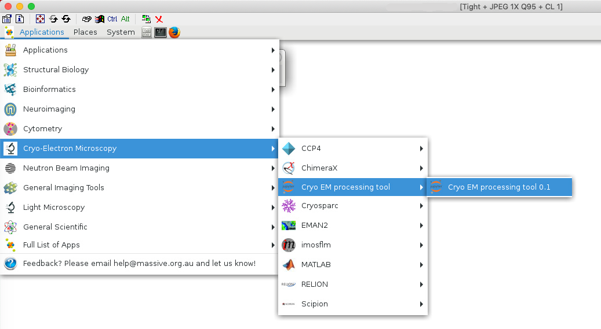


2. Press Shift+Enter 6 times to execute the notebook. Alternatively, on the Notebook menu, click the Run button 6 times.

    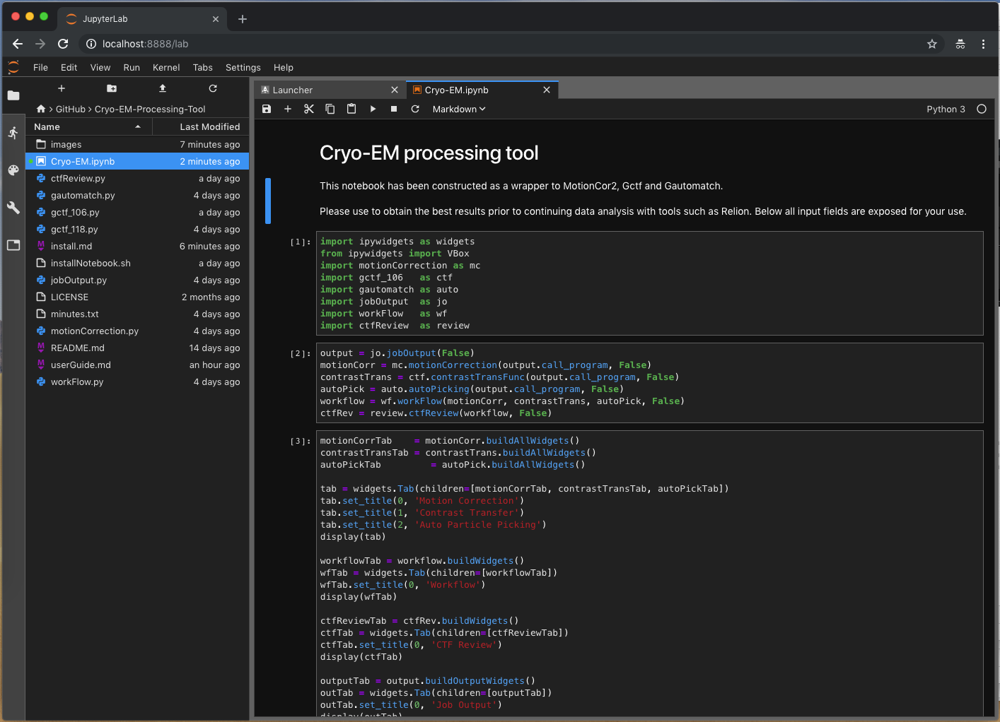

3. The Cryo-EM processing tool is now ready.

    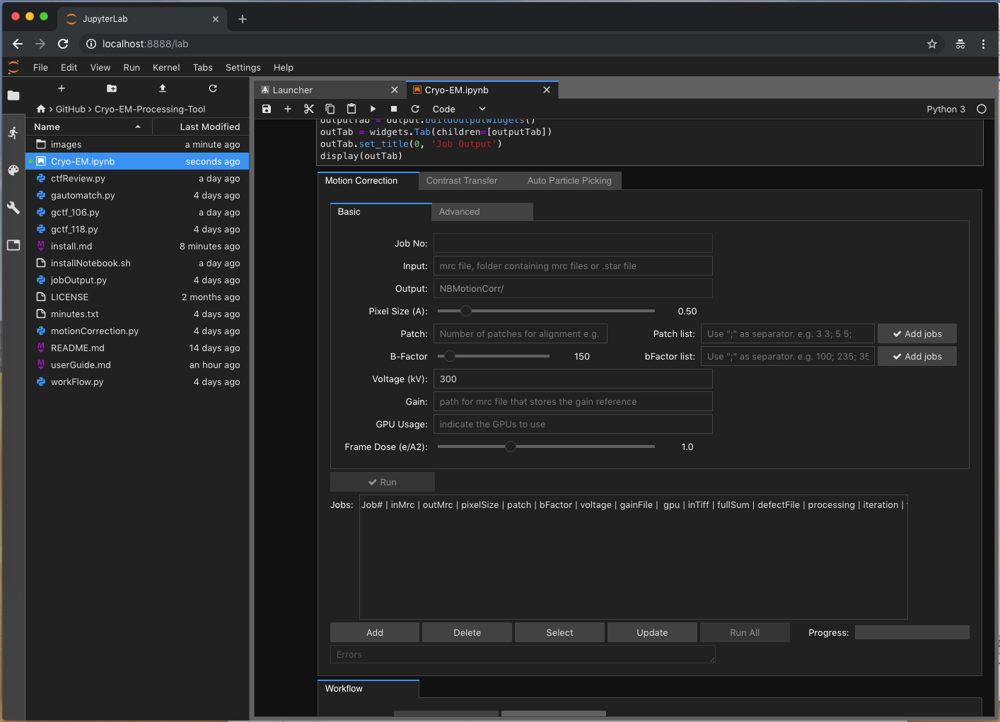

## Using the tool

There are three main tabs, representing each program:

1. Motion Correction, based on MotionCor v2.1

  The tabs 'Basic' and 'Advanced' contain all the input fields.

  

2. Contrast Transfer, based on Gctf v1.06

  The tabs 'Normal', 'Phase Plate Options', 'Additional Options', 'Advanced Additional', 'Defocus Frame/Local', 'CTF Refinement' and 'CTF and IO' contain all the input fields.

  

3. Auto Particle Picking, based on gautomatch 0.56

  The tabs 'Basic', 'Additional', and 'I/O' contain all the input fields.

  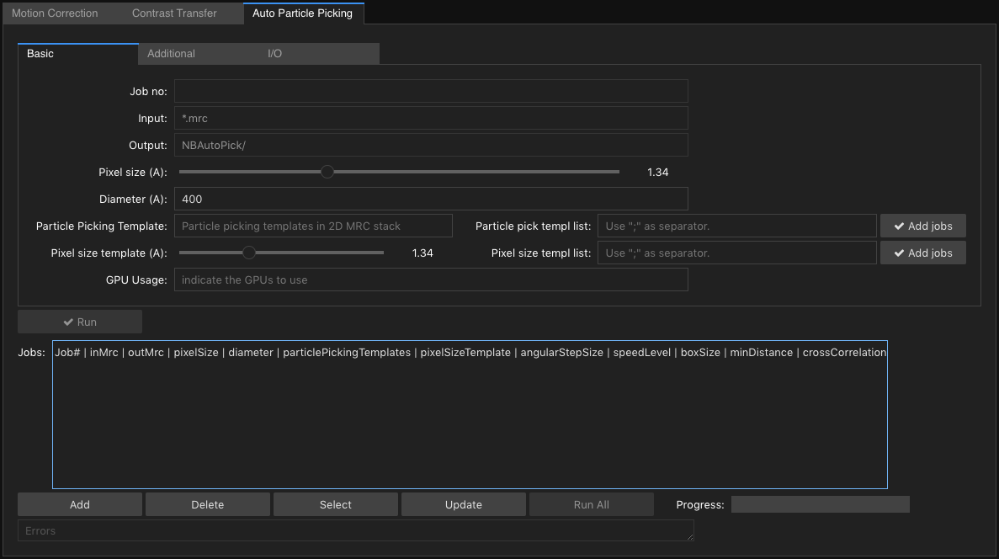

Each tab, works independently of the others. Jobs are created on each tab, only for that program.

__Creating jobs__
1. Add jobs:
    * Complete all fields as required. Ensure you complete the fields on all tabs. e.g. 'Basic' and 'Advanced' for Motion correction.
    * Click on 'Add' to create the job. A new row will appear in the 'Jobs' field.
    * Alter values as required and click 'Add' to create more jobs.
2. Delete jobs:
    * Using your mouse, select a job row. Multiple jobs can be selected by pressing 'Windows/Unix': Cntrl + left mouse click or 'Mac': Command + left mouse click
    * Click Delete.
4. Update job:
    * Select the job and click 'Select'.
    * Alter values as required.
    * Click 'Update'.

### Processing modes

The tool has been constructed to run MotionCor2, Gctf and Gautomatch as 'single' independent programs or in a 'workflow' mode to match the [Relion](https://www2.mrc-lmb.cam.ac.uk/relion/index.php?title=Main_Page) directory structure.

This tool has been defaulted to 'Workflow' mode.


#### Single process mode

To enable, click on the 'Single' button on the Workflow tab.

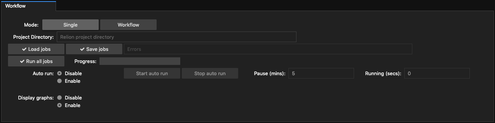

Single process mode enables user input for the input/output fields and the 'Run' and 'Run All' buttons for all three programs.

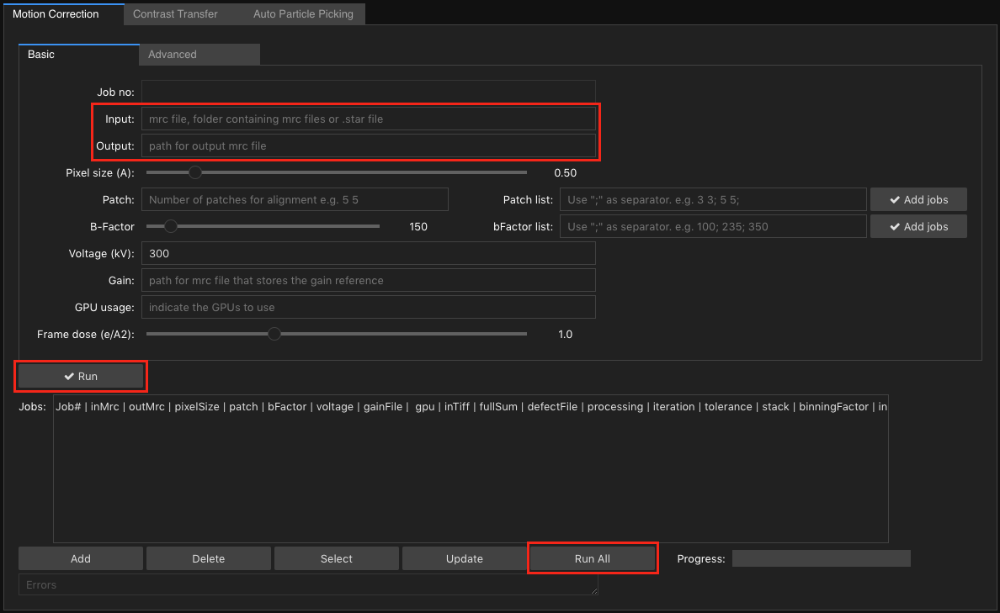


__Running a single job__
  - clicking the 'Run' button will execute the program based on the input fields.

__Running multiple jobs__

  This process allow you to run the program against the same or different input files by altering parameters to obtain the best results for your data.

  1. Add jobs:
      * Jobs can be added, deleted and updated as described above.
  2. Run jobs:
      * Clicking on 'Run All' will execute all jobs sequentially.

**Note**: When running MotionCor2, Gctf or Gautomatch from any of these tabs in 'Single' mode, the programs behave as if they had been executed on the command line.

For a single program execution or job, all output, errors and Arguments are written to the fields, 'Standard output', 'Standard Error' and 'Arguments' displayed on the 'Job Output' tab.

The values from these fields are also written to files in the destination folder for your reference.  
These files are appended for each program run.

_programName_-arguments.txt  
_programName_-error.txt  
_programName_-output.txt  

  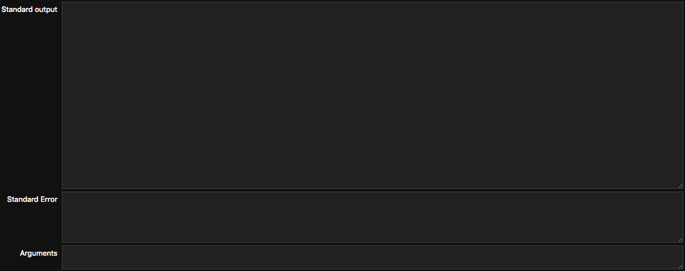

#### Workflow mode

Workflow mode has been built to allow processing using all the options for MotionCor2, Gctf and Gautomatch while maintaining compatibility with the Relion 2 directory structure.

  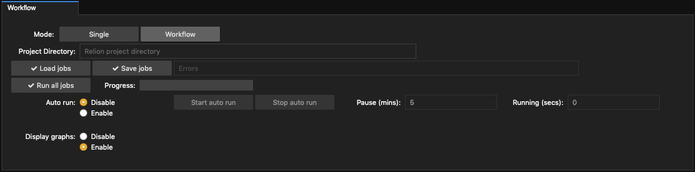

For all programs in 'workflow' mode, the 'Input' and 'Output' fields plus the 'Run' and 'Run all' buttons are disabled. Only the 'Input' field for Motion Correction remains enabled.

  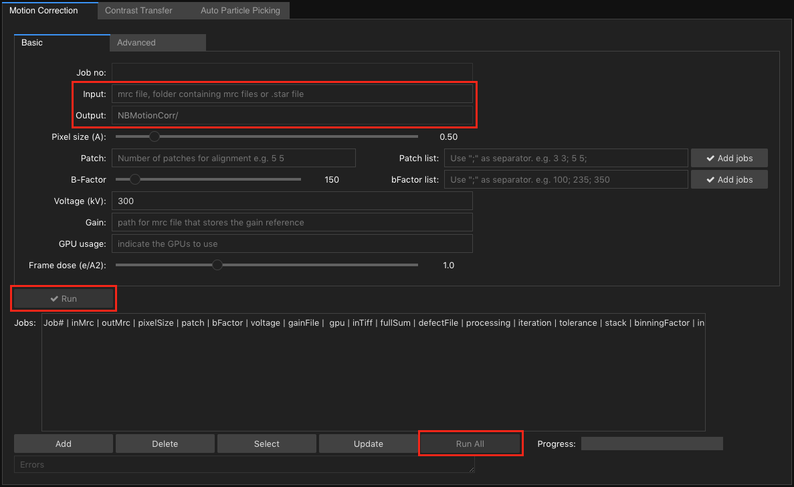

Ensure you have no 'Jobs' created in 'Single' mode as they will cause the 'Workflow' process to behave unexpectedly. e.g. file paths may be incorrect to maintain compatibility with the Relion workflow.

1. Click on the 'Workflow' button.

2. Add the full path of your Relion project to 'Project Directory'

  

3. Workflow mode, reads a Relion '.star' file as input. For the Motion Correction 'Input' field, enter the file path relative to the Relion project directory.

  

  **Assumption:** Relion 'Import' function is used to create the .star file.

4. Create jobs for Motion Correction, Contrast Transfer Function and Auto Particle Picking.

5. On the 'Workflow' tab, click on 'Run all jobs'. This will execute all Motion Correction jobs. It will then run all Contrast Transfer Function jobs using the output from the Motion Correction jobs as input and lastly, Auto Particle picking will run all jobs using the output from the Motion Correction jobs as input.

6. All workflow jobs can be loaded and saved to disk by clicking on the 'Load jobs' and 'Save jobs' buttons. The file 'workflowJobs.data' will be created in the Project Directory. This feature allows you to develop a set of jobs, known to produce quality output for reuse on future datasets.

  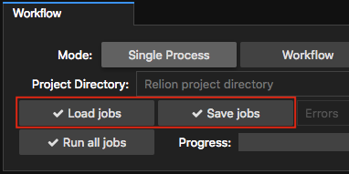

  **Note:** Loading and saving of jobs can be used in single workflow mode. 'Project Directory' is where the file 'workflowJobs.data' will be stored.

##### Workflow output

Below is a sample directory structure, relative to the Relion project directory, that is created when 2 jobs exist for each program.

```
  NBMotionCorr/mc1/Micrographs/
  NBMotionCorr/mc2/Micrographs/
  NBCtfFind/ctf1/Micrographs/
  NBCtfFind/ctf2/Micrographs/
  NBAutoPick/pick1/Micrographs/
  NBAutoPick/pick2/Micrographs/
```

The directory names NBMotionCorr, NBCtfFind, NBAutoPick have been chosen to make a distinction between this workflow and those folders created by Relion for the same processing.

The directories: mc1, mc2, ctf1, ctf2, pick1 and pick2 are the jobs created.


'NBMotionCorr/mc1/Micrographs/' and 'NBMotionCorr/mc2/Micrographs/' contain the output files from motioncor for the jobs mc1 and mc2.

```
MotionCor2 output files:
  Falcon_2012_06_12-14_33_35_0_DW.mrc
  Falcon_2012_06_12-14_33_35_0.mrc
```

'NBCtfFind/ctf1/Micrographs/' and 'NBCtfFind/ctf2/Micrographs/' contain symlinks to all non dose weighted files from motioncor2 for jobs mc1 and mc2, plus the output from gctf for the jobs 'ctf1' and 'ctf2'. __Note: Only non dose weighted output files from motioncor2 are used as input to gctf.__

```
Gctf output files:
  mc1-Falcon_2012_06_12-14_33_35_0.ctf
  mc1-Falcon_2012_06_12-14_33_35_0_EPA.log
  mc1-Falcon_2012_06_12-14_33_35_0_gctf.log
  mc1-Falcon_2012_06_12-14_33_35_0.mrc
  mc2-Falcon_2012_06_12-14_33_35_0.ctf
  mc2-Falcon_2012_06_12-14_33_35_0_EPA.log
  mc2-Falcon_2012_06_12-14_33_35_0_gctf.log
  mc2-Falcon_2012_06_12-14_33_35_0.mrc
```

'NBAutoPick/pick1/Micrographs/' and 'NBAutoPick/pick2/Micrographs/' contain symlinks to all non dose weighted files from motioncor2 for jobs mc1 and mc2, plus the output from gautomatch for the jobs 'pick1' and 'pick2'. __Note: Only non dose weighted output files from motioncor2 are used as input.__

```
Gautomatch output files:
  mc1-Falcon_2012_06_12-14_33_35_0_automatch.box
  mc1-Falcon_2012_06_12-14_33_35_0_automatch.star
  mc1-Falcon_2012_06_12-14_33_35_0.mrc
  mc1-Falcon_2012_06_12-14_33_35_0_nonunique.box
  mc1-Falcon_2012_06_12-14_33_35_0_rejected.box
  mc1-Falcon_2012_06_12-14_33_35_0_rejected.star
  mc2-Falcon_2012_06_12-14_33_35_0_automatch.box
  mc2-Falcon_2012_06_12-14_33_35_0_automatch.star
  mc2-Falcon_2012_06_12-14_33_35_0.mrc
  mc2-Falcon_2012_06_12-14_33_35_0_nonunique.box
  mc2-Falcon_2012_06_12-14_33_35_0_rejected.box
  mc2-Falcon_2012_06_12-14_33_35_0_rejected.star
```

__Important__ Note how the files for Contrast Transfer Function (ctf) and Auto Particle Picking (gautomatch) are prefixed with 'mc1' and 'mc2'. This represents the job output from Motion Correction. Each job for gctf and gautomatch is run against all job output from motion correction.

##### Customise

The directory names  (e.g. NBMotionCorr) and job prefixes (e.g. 'mc') can be customised by editing the appropriate python script.

workFlow.py contains the folder names. Just edit as shown here.

```
#Workflow processing for all programs and jobs.

class workFlow:
    #Settings:
    outputFilename = 'workflowJobs.data'
    motionCorrFolderName = 'NBMotionCorr/'
    gctfFolderName       = 'NBCtfFind/'
    gautomatchFolderName = 'NBAutoPick/'
```

motionCorrection.py, gctf-106.py and gautomatch.py each contain the job prefix. Just edit as shown here.

```
#Motion Correction input fields and functions to execute jobs

class motionCorrection:
    #Settings:
    program = 'motioncor2'
    jobPrefix = 'mc'
```

##### Workflow Auto run

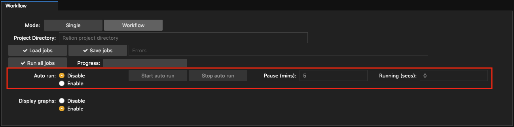


The auto run functionality has been added to continually process new micrographs as they are produced by the Cryo EM.

 1. Click on the Enable radio button.

 2. Specify the pause between runs in minutes.

 3. Click on 'Start auto run'.

 4. Click on 'Stop auto run' when required.

 Autorun is equivalent to clicking on 'Run all jobs' every X minutes. The three programs MotionCor2, gctf and gautomath have been configured to only process new micrographs. Previously processed micrographs are ignored.


 ##### Workflow Display Graphs

 To assist in monitoring data quality, ensure 'Display graphs' is enabled.

 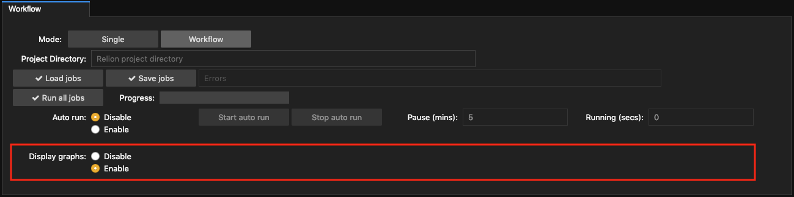

 For each job run, the graphs will be constructed. The graphs are built using output created by Gctf. The purpose of the graphs is to provide a visual cue for monitoring data quality.  

 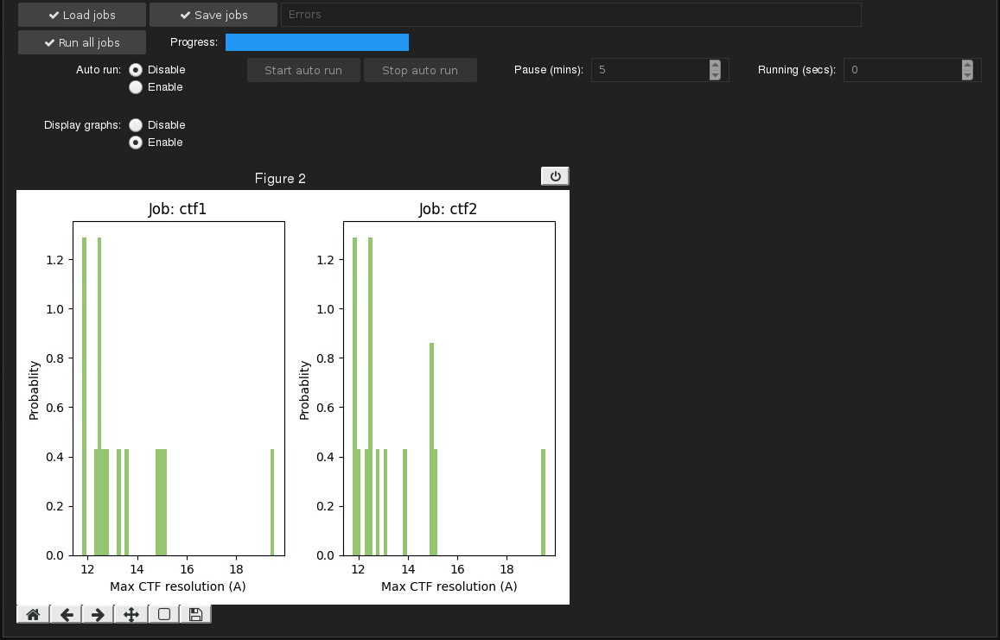

### CTF Review

CTF Review allows the output from Gctf to be displayed, reviewed, filtered and saved as a .star file ready for continued analysis inside Relion.

  1. Click on 'Start Review'. This requires the 'Project Directory' to be completed in the 'Workflow' tab. The program then determines the existing CTF jobs.

  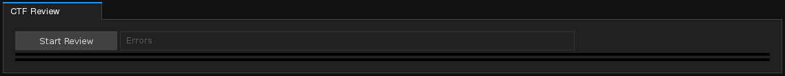

  2. A list of available jobs is displayed, the total number of micrographs for each job, fields for filtering results, ordering the results and the total number of filtered micrographs.

  

  3. Alter the filter fields and order as required, click 'Apply'.

  This will recalculate the total number of CTF micrographs and display them.

  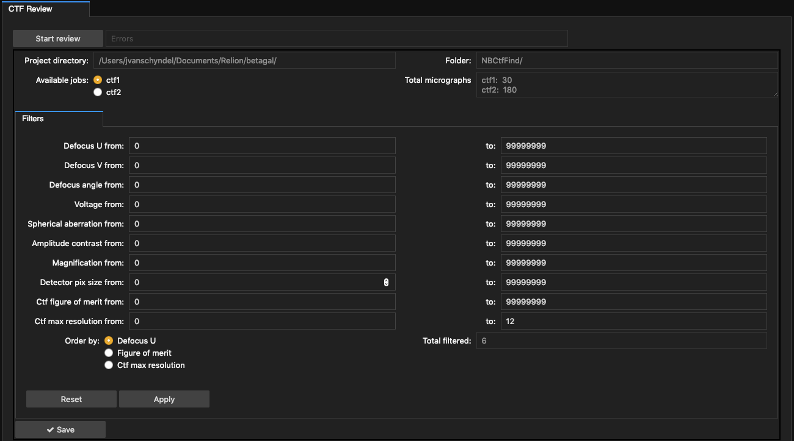

  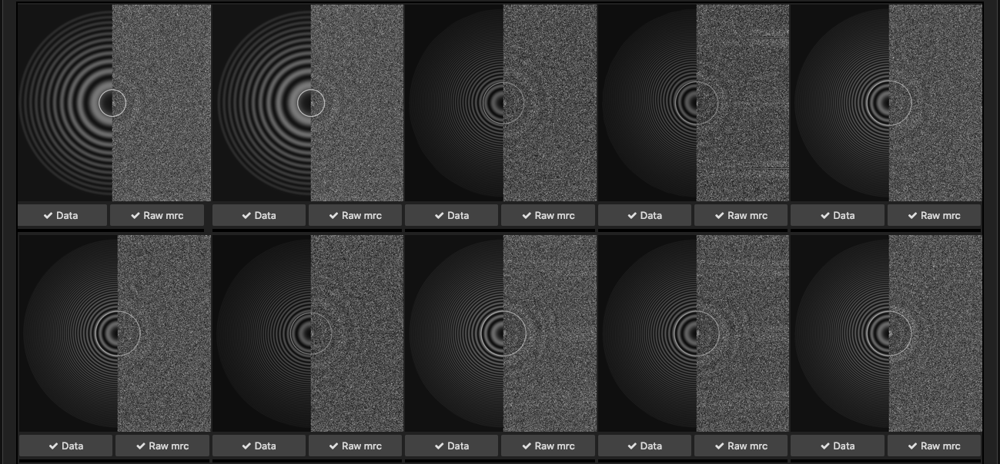

  4. For each CTF micrograph, the data can be viewed by clicking on the 'Data' button.

  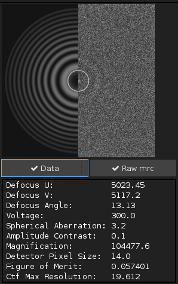

  OR view the input to CTF by clicking on the 'Raw mrc' button.

  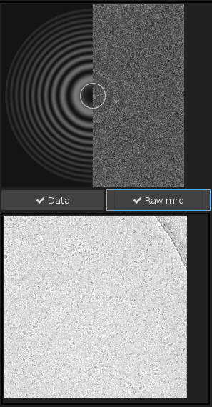

  5. Repeat step 3. until a list of desired micrographs is displayed.

  6. When ready, clicking 'Save' creates a 'selected_micrographs_ctf.star' file inside the 'job' folder. This file can be used to continue processing inside Relion on the filtered micrographs.

```
relionProjectDirectoryPath/NBCtfFind/ctf1/selected_micrographs_ctf.star
```
